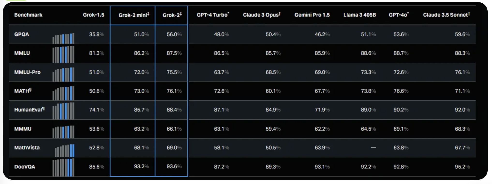

# General LLM Benchmark
These are the most commonly utilized LLM Benchmarks among models’ technical reports:

* **MMLU** - Multitask accuracy
* **HellaSwag** - Reasoning
* **HumanEval** - Python coding tasks
* **BBHard** - Probing models for future capabilities
* **GSM-8K** - Grade school math
* **MATH** - Math problems with 7 difficulty levels

## GPQA (General Purpose Question Answering)
**What it Tests:** GPQA benchmarks measure a model's ability to answer a wide range of general-purpose questions. These can include questions from various domains, including common knowledge, current events, and specialized fields.  
**Key Skills Tested:** General knowledge, reasoning, language understanding, and context comprehension.  

## MMLU (Massive Multitask Language Understanding)
**What it Tests:** MMLU evaluates a model's ability to perform across a diverse set of language-based tasks. It includes questions from 57 different subjects, covering everything from elementary mathematics to advanced science topics.  
**Key Skills Tested:** Multitask learning, subject-specific knowledge, language understanding.  

## MMLU-Pro
**What it Tests:** MMLU-Pro is an enhanced benchmark designed to evaluate the language understanding capabilities of LLMs across a broader and more challenging set of tasks. It builds upon the original Massive Multitask Language Understanding (MMLU) dataset by addressing several limitations and introducing new features to increase the difficulty and robustness of the evaluation..  
**Key Skills Tested:** Advanced subject-specific knowledge, professional-level reasoning.  

## HellaSwag (Sentence Completion)
**What it Tests:** HellaSwag is a challenge dataset for evaluating commonsense NLI that is specially hard for state-of-the-art models, though its questions are trivial for humans (>95% accuracy)  
**Key Skills Tested:** The main goal of HellaSwag is to evaluate whether AI models can apply commonsense reasoning to understand and predict outcomes in various scenarios, making it a crucial benchmark for assessing the depth of understanding and reasoning capabilities in natural language processing (NLP) models.

## MATH
**What it Tests:** MATH is a new dataset of 12,500 challenging competition mathematics problems. Each problem in MATH has a full step-by-step solution which can be used to teach models to generate answer derivations and explanations.  
**Key Skills Tested:** Numerical reasoning, problem-solving, symbolic manipulation, and mathematical logic.  
**Leaderboard**: https://paperswithcode.com/sota/math-word-problem-solving-on-math

## HumanEval (Python Coding Tasks)
**What it Tests:** It consists of 164 original programming problems, assessing language comprehension, algorithms, and simple mathematics, with some comparable to simple software interview questions.  
**Key Skills Tested:** Coding ability, syntax understanding, logical problem-solving, and programming language fluency.  
**Leaderboard**: https://paperswithcode.com/sota/code-generation-on-humaneval

## MMMU
**What it Tests:** a new benchmark designed to evaluate multimodal models on massive multi-discipline tasks demanding college-level subject knowledge and deliberate reasoning. MMMU includes 11.5K meticulously collected multimodal questions from college exams, quizzes, and textbooks, covering six core disciplines: Art & Design, Business, Science, Health & Medicine, Humanities & Social Science, and Tech & Engineering. These questions span 30 subjects and 183 subfields, comprising 30 highly heterogeneous image types, such as charts, diagrams, maps, tables, music sheets, and chemical structures.  
**Key Skills Tested:** MMMU is designed to measure three essential skills in LMMs: perception, knowledge, and reasoning.  

## MathVista
**What it Tests:** MathVista seems to be another benchmark focused on mathematics, potentially with a focus on more visualization-based or application-based mathematical tasks.  
**Key Skills Tested:** Applied mathematics, problem-solving with visual components, and mathematical reasoning.  

## DocVQA
**What it Tests:** DocVQA benchmarks evaluate how well a model can answer questions based on the content of documents. This typically involves understanding text within complex layouts, tables, forms, and scanned documents.  
**Key Skills Tested:** Document understanding, OCR (Optical Character Recognition), text comprehension, and information extraction.  

 
